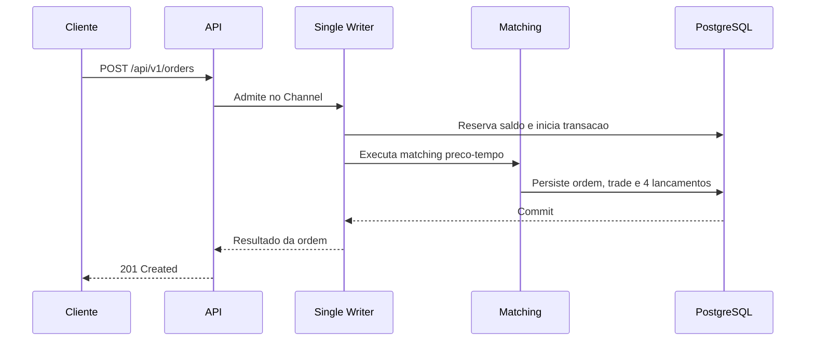

# Meli Order Book

API para negociacao de Vibranium contra BRL. O desafio implementa submissao de
ordens BUY/SELL, reservas de saldo, matching por preco-tempo, liquidacao
atomica e historico auditavel em PostgreSQL.

## Avaliacao Rapida

Pre-requisitos: Docker com Docker Compose. Para executar os testes, tambem e
necessario o .NET SDK 10.

```bash
make down-clean
make up-d
until curl --fail --silent http://localhost:8080/api/v1/ready >/dev/null; do sleep 1; done
curl -i http://localhost:8080/api/v1/ready
```

Quando a resposta for `200 OK`, os principais pontos de avaliacao estao
disponiveis:

| Recurso | Endereco |
|---|---|
| API e OpenAPI interativo | http://localhost:8080/swagger/index.html |
| Documento OpenAPI | http://localhost:8080/openapi/v1.json |
| Dashboard de negocio | http://localhost:3000/d/orderbook-business |
| Prometheus | http://localhost:9090 |

Para parar e limpar o ambiente local:

```bash
make down-clean
```

## Demonstracao

Os usuarios seedados permitem executar este fluxo imediatamente:

| Papel | userId |
|---|---|
| Comprador | `00000000-0000-0000-0000-000000000001` |
| Vendedor | `00000000-0000-0000-0000-000000000002` |

Envie primeiro uma compra e depois uma venda compativel. Os valores de BRL sao
sempre enviados em centavos.

```bash
curl -i -X POST http://localhost:8080/api/v1/orders \
  -H 'Content-Type: application/json' \
  --data '{"userId":"00000000-0000-0000-0000-000000000001","side":"BUY","priceBrlCents":150000,"quantity":1}'

curl -i -X POST http://localhost:8080/api/v1/orders \
  -H 'Content-Type: application/json' \
  --data '{"userId":"00000000-0000-0000-0000-000000000002","side":"SELL","priceBrlCents":150000,"quantity":1}'
```

As duas chamadas retornam `201 Created`. A primeira ordem fica `OPEN`; a
segunda a executa, retorna `FILLED` e cria um trade. Consulte o resultado:

```bash
curl -s http://localhost:8080/api/v1/order-book
curl -s 'http://localhost:8080/api/v1/trades?limit=50'
```

O fluxo completo, com saldos esperados, esta em
[`docs/guia-uso-api.md`](docs/guia-uso-api.md). A collection Postman esta em
[`docs/postman/orderbook-collection.json`](docs/postman/orderbook-collection.json).

## Fluxo de Uma Ordem



O fluxo detalhado, incluindo rejeicao, recovery e shutdown, esta em
[`docs/diagrams/order-flow.md`](docs/diagrams/order-flow.md).

## Regras de Negocio

- BUY reserva `quantidade x preco` em BRL; SELL reserva a quantidade de
  Vibranium.
- O matching usa prioridade de preco e, em empate, ordem de aceite (FIFO).
- Um trade sempre ocorre no preco da maker, suporta fills parciais e multiplos
  fills.
- Cada trade gera quatro lancamentos de ledger: debito/credito de BRL e
  debito/credito de Vibranium.
- A ordem e persistida como `REJECTED` quando nao ha saldo suficiente, sem
  criar reserva, trade ou ledger parcial.
- Cada `POST /api/v1/orders` e uma nova submissao. A API gera a chave interna
  necessaria para persistir o resultado; nao envie `Idempotency-Key`.

## Arquitetura

O projeto e um Modular Monolith em .NET 10, organizado em Vertical Slices com
Ports & Adapters. Um Single Writer serializa mutations do livro; PostgreSQL e a
fonte de verdade para ordens, reservas, trades e ledger. O livro em memoria e
publicado somente apos o commit da transacao e reconstruido no startup.

O diagrama detalhado esta em
[`docs/diagrams/order-flow.md`](docs/diagrams/order-flow.md). As decisoes e
invariantes normativas estao em [`docs/002-arquitetura.md`](docs/002-arquitetura.md)
e [`docs/004-sdd.md`](docs/004-sdd.md).

## Evidencias de Qualidade

```bash
make test
```

Atualmente, a solucao possui 38 testes distribuidos entre arquitetura, unidade,
integracao e fluxos funcionais contra PostgreSQL real via Testcontainers. O
guia [`docs/guia-testes.md`](docs/guia-testes.md) descreve a finalidade de cada
suite e os cenarios cobertos.

Os scripts K6 e seu protocolo estao em [`docs/benchmark.md`](docs/benchmark.md).
Os resultados sao gravados em `benchmarks/results/`; os numeros de throughput
sao resultados de benchmark, nao capacidades declaradas por configuracao.

## Observabilidade

O ambiente local sobe Prometheus, Grafana, Loki, Tempo e Alloy junto da API.
O dashboard de negocio apresenta compras recebidas, vendas recebidas, consultas
de ordem e negocios executados. O dashboard atualiza a cada 10 segundos.

Detalhes de metricas, traces e dashboards estao em
[`deploy/observability/README.md`](deploy/observability/README.md).

## Limites do MVP

Ficam fora do escopo: autenticacao, cancelamento de ordens, market orders,
taxas, multiplos ativos, interface grafica e escala horizontal.

## Desenvolvimento Assistido por IA

O projeto foi desenvolvido com apoio do OpenCode. A pasta `.opencode/` reune a
configuracao do desenvolvimento assistido, e `AGENTS.md` define as regras de
qualidade e governanca aplicadas ao repositorio.
