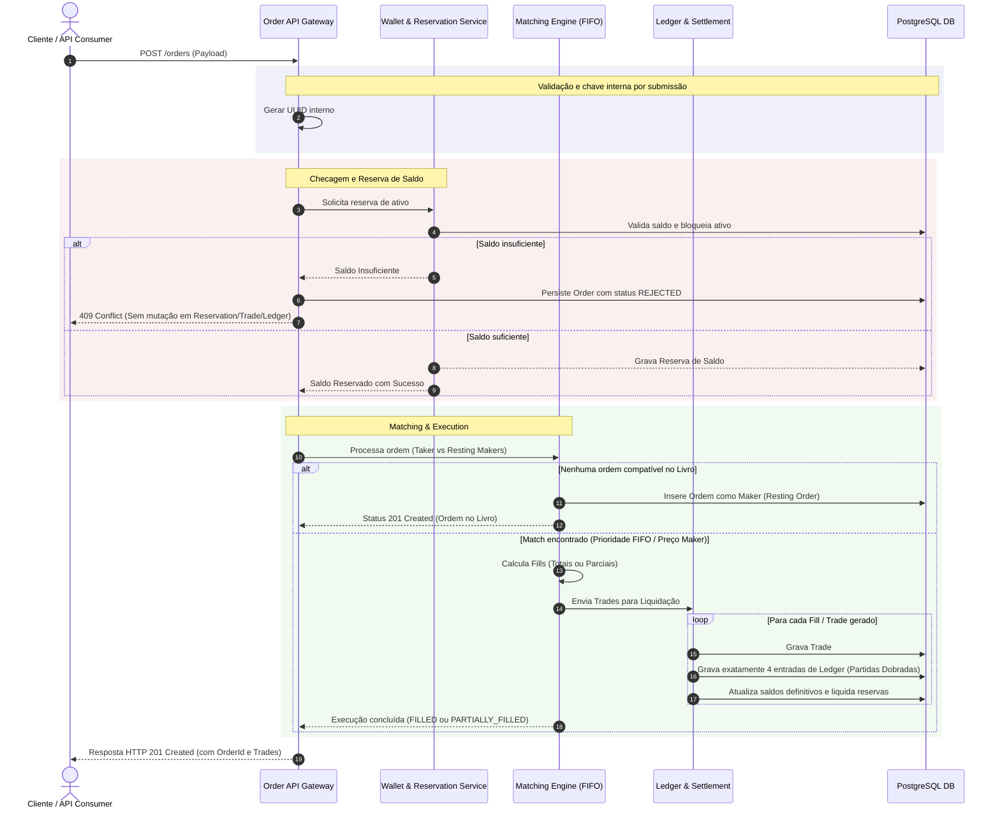

# 📈 Order Book & Financial Settlement Engine

Módulo central de Livro de Ofertas e Liquidação Financeira (Settlement) focado em **alta consistência, idempotência e auditoria contábil**. O sistema gerencia o ciclo de vida completo de ordens de compra e venda do para **Vibranium**, garantindo a conservação de ativos e consistência em ambiente PostgreSQL real.

---

## 📐 Diagrama de Sequência

O diagrama abaixo descreve a interação ponta a ponta quando uma ordem é recebida pela API, passa pela reserva na **Wallet**, é processada pelo **Matching Engine** e tem seus efeitos registrados de forma atômica no **Ledger**:



---

## 🎯 Visão Geral do Sistema

A API implementa a execução e liquidação de ordens financeiras com garantia de consistência estrita através dos seguintes pilares:

* **Reserva Preventiva de Saldo:** Bloqueio e liberação imediata de ativos (BRL para compras, Vibranium para vendas) para evitar *double spending*.
* **Motor de Matching Determinístico:** Casamento de ofertas priorizando **Preço/Tempo (FIFO)** e garantindo o preço do *Maker*.
* **Contabilidade de Partidas Dobradas (Ledger):** Liquidação auditável onde cada *Trade* gera exatamente 4 lançamentos contábeis.
* **Garantia de Idempotência:** Chaves únicas por operação que previnem duplicação de ordens ou alterações inconsistentes de payload.

---

## ⚙️ Regras de Negócio e Fluxos Operacionais

### 1. Gestão de Carteira e Reservas (`BDD-01`, `BDD-02`, `BDD-03`)
Antes de entrar no livro de ofertas, o saldo do usuário é validado e reservado no banco de dados.

* **Ordem BUY:** Reserva o limite total em **BRL** (`preço * quantidade`).
* **Ordem SELL:** Reserva o montante em **Vibranium**.
* **Saldo Insuficiente:** A ordem é rejeitada com status HTTP `409 Conflict`, gravada com status `REJECTED`, e nenhuma alteração (*Reservation*, *Trade* ou *Ledger*) é criada.

---

### 2. Submissões de Ordem
Cada `POST /api/v1/orders` é uma nova submissão. A API gera uma chave interna para persistir o resultado e não recebe `Idempotency-Key` do cliente.

---

### 3. Motor de Matching e Livro de Ofertas (`BDD-06` a `BDD-10`)
O motor processa ordens *Taker* contra ordens *Maker* que estão na pedra (*resting*).

* **Preço do Executante (Price Priority):** O valor da transação é fixado sempre no preço do **Maker** (ordem que já estava no livro).
* **Prioridade Temporal (FIFO):** Ordens *Maker* no mesmo patamar de preço são consumidas em ordem cronológica de chegada.
* **Execução Parcial (Partial Fills):** Se a ordem *Taker* for maior que a *Maker*, ela assume o status `PARTIALLY_FILLED`, mantendo o saldo restante (`remaining`) no livro para novos casamentos.
* **Self-Trade:** A API aceita cruzamento de ordens do mesmo usuário (*BUY* vs *SELL* própria), processando e liquidando com lançamento de livro normal.

---

### 4. Liquidação e Conservação de Ativos (`BDD-09`, `BDD-11`)
O processo de liquidação (*settlement*) garante que nenhum centavo de BRL ou fração de Vibranium seja criado ou destruído sem rastreamento contábil.

#### Regra dos 4 Registros de Ledger
Cada transação (*Trade*) confirmada gera **exatamente 4 entradas no Ledger** em uma única transação atômica:

1. **Débito BRL** da carteira do Comprador (liberando o saldo reservado).
2. **Crédito BRL** na carteira do Vendedor.
3. **Débito Vibranium** da carteira do Vendedor (liberando o ativo reservado).
4. **Crédito Vibranium** na carteira do Comprador.

> **Princípio de Conservação:** A soma de todo o BRL e todo o Vibranium no sistema permanece constante antes e depois da liquidação de cada Trade.

---

## 📋 Mapeamento de Testes e Cobertura BDD

| ID | Cenário | Comportamento Esperado | Status HTTP |
| :--- | :--- | :--- | :--- |
| **BDD-01** | Reservar BRL (BUY) | Bloqueia saldo em BRL na carteira do comprador | `201 Created` |
| **BDD-02** | Reservar Vibranium (SELL) | Bloqueia saldo em Vibranium na carteira do vendedor | `201 Created` |
| **BDD-03** | Saldo insuficiente | Transação abortada; Ordem persistida como `REJECTED` | `409 Conflict` |
| **BDD-06** | Preço do Maker | Transação é fechada com o valor estipulado pelo Maker | `201/200 OK` |
| **BDD-07** | Fila FIFO | Consome primeiramente a ordem Maker mais antiga | `201/200 OK` |
| **BDD-08** | Execução parcial | Ordem Taker fica como `PARTIALLY_FILLED` com `remaining > 0` | `201/200 OK` |
| **BDD-09** | Múltiplos Fills | Cria 1 Trade e 4 registros de Ledger por Maker consumido | `201/200 OK` |
| **BDD-10** | Self-Trade | Aceita e liquida ordem cruzada do próprio usuário | `201/200 OK` |
| **BDD-11** | Conservação e Settlement | Conservação total dos saldos e liquidação atômica | `200 OK` |

---

## 🛠️ Especificação do Payload de Entrada

### Criar uma Ordem (`POST /orders`)

**Header:**
```http
Content-Type: application/json
```

**Body:**
```json
{
  "userId": "usr_998231",
  "side": "BUY",
  "priceBrlCents": 150000,
  "quantity": 10
}
```
