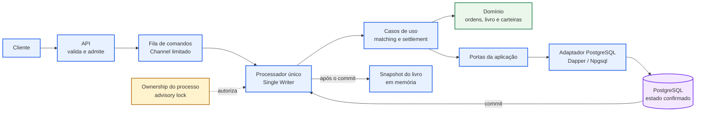
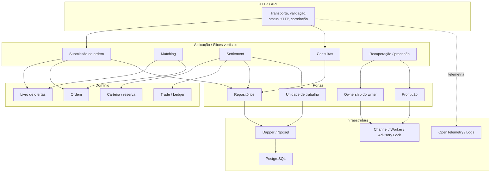
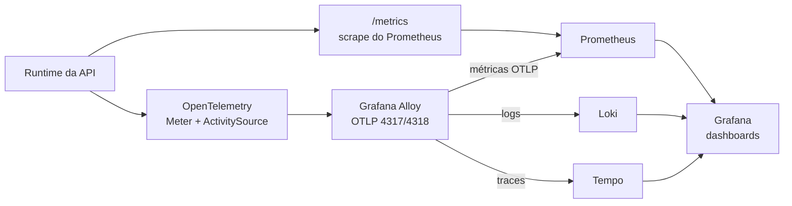

# Arquitetura da V1

## Visão Geral

A V1 é estruturada como um monólito modular de alta consistência. A API recebe as ordens, valida o formato e as enfileira; um processador exclusivo (**Single Writer**) consome essa fila sequencialmente para garantir execução determinística sem contenção de concorrência.

O processador executa o **matching** (casamento entre ordens compatíveis no livro) e o **settlement** (liquidação financeira com atualização de saldos). Toda a operação é persistida dentro de uma transação atômica no PostgreSQL. Para evitar *dirty states*, o **snapshot do livro em memória só é atualizado estritamente após o commit** bem-sucedido no banco.

O cliente envia uma ordem via API, que realiza a validação de formato/payload e enfileira o comando. Um processador exclusivo (**Single Writer**) consome essa fila sequencialmente, garantindo execução determinística sem contenção de concorrência. Ele executa o matching (casamento entre ordens compatíveis no livro) e o settlement (liquidação financeira com atualização de saldos).

O domínio isola as regras de negócio de ordens, livro e carteiras sem dependência direta de infraestrutura, comunicando-se com a camada de persistência através de Portas implementadas por um Adaptador PostgreSQL. Toda a operação é executada dentro de uma transação atômica no banco de dados. O snapshot do livro em memória é atualizado estritamente após o commit bem-sucedido.

Para garantir alta disponibilidade sem risco de duas instâncias alterarem o livro simultaneamente, a aplicação utiliza um **Advisory Lock** — um bloqueio exclusivo gerenciado no próprio PostgreSQL. Esse mecanismo funciona como uma eleição de líder (Leader Election): apenas a instância que obtém essa trava ganha a autorização para processar mutações de estado. Em cenários de startup ou recuperação de falhas (failover), a nova instância líder assume o controle, reidrata o livro em memória lendo o estado confirmado no banco de dados e só então passa a processar novas ordens da fila.
---

## Fronteiras e Responsabilidades

A aplicação adota os princípios de **Hexagonal Architecture** combinados com **Vertical Slices**. O domínio encapsula as regras de negócio puras (ordens, livro e carteiras) e não possui dependências diretas de bibliotecas ou infraestrutura externa.

As dependências seguem rigorosamente a direção `HTTP/Aplicação -> Domínio e Portas -> Infraestrutura`. A camada de domínio é isolada e não referencia ASP.NET Core, Dapper, Npgsql ou PostgreSQL.

---

## Observabilidade

A infraestrutura de telemetria combina rastreamento distribuído (Traces), métricas e logs estruturados em um pipeline desacoplado do caminho de execução financeira.

O *scrape* da rota `/metrics` via Prometheus e o envio assíncrono OTLP/remote-write operam de forma distinta. As duas fontes não devem ser somadas em uma mesma consulta para evitar duplicidade de telemetria. Todo o pipeline de observabilidade é não-bloqueante em relação às transações do Order Book.
