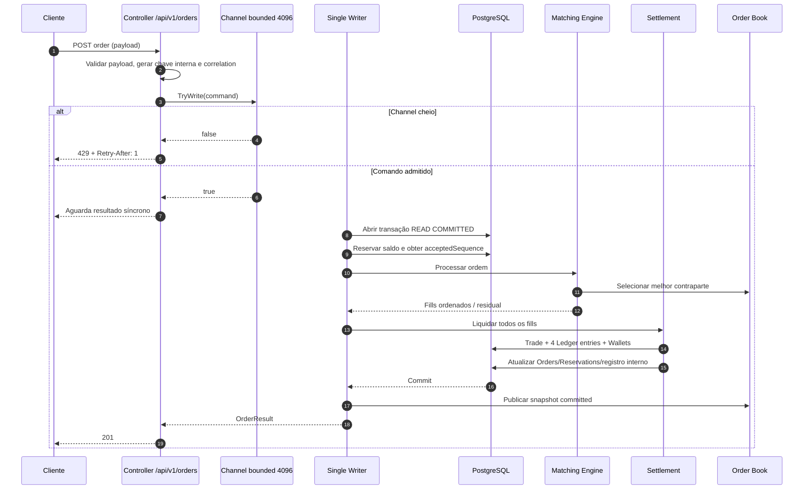
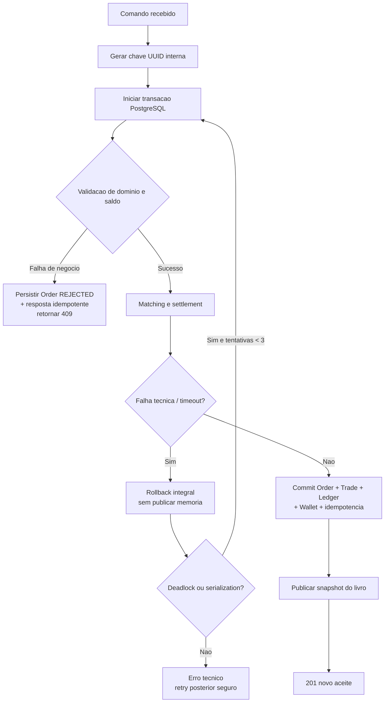
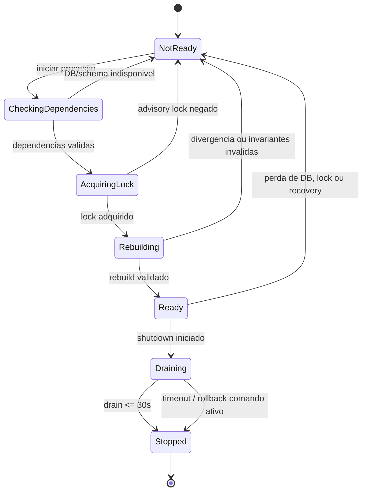

# Fluxos da V1

## Submissao, matching e settlement



## Chave interna e falhas transacionais



## Startup, recovery e readiness



## Shutdown e observabilidade

```mermaid
flowchart LR
    Signal[SIGTERM / shutdown] --> False[Readiness = false]
    False --> StopAdmission[Bloquear novas admissions]
    StopAdmission --> Close[Fechar entrada do Channel]
    Close --> Drain[Drenar comandos admitidos\naté 30 segundos]
    Drain --> Active{Comando ativo?}
    Active -- Nao --> Stop[Encerrar processo]
    Active -- Sim --> Finish[Concluir e commitar\nou cancelar e rollback]
    Finish --> Stop

    Runtime[API runtime] --> Metrics[8 métricas normativas]
    Runtime --> Logs[Logs JSON redigidos]
    Runtime --> Traces[Traces HTTP → Channel → DB]
    Metrics --> Scrape[/metrics]
    Scrape --> Prom[Prometheus]
    Traces --> Alloy[Alloy OTLP]
    Logs --> Alloy
    Alloy --> Tempo[Tempo]
    Alloy --> Loki[Loki]
    Prom --> Grafana[Grafana 19924/19925]
    Tempo --> Grafana
    Loki --> Grafana
```

Exportação para Alloy, Loki e Tempo é assíncrona e não pode bloquear o caminho
financeiro. `database_batch_size` permanece sempre igual a `1`.
